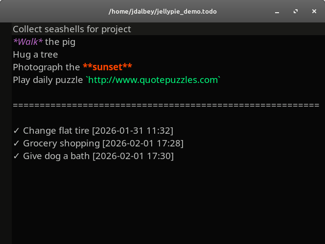

# Jellypie ToDo


**Jellypie** is a lightweight, minimalist, single-file text editor designed for simplicity and todo list management.   built with **Python 3**, **GTK4**, and **GtkSourceView 5**. 

---

## 🚀 Version
**3**     
For detailed changes, see the [CHANGELOG](CHANGELOG.md).

  
*Jellypie* editor window showing syntax highlighting and completed items.

---

## ✨ Features

- Single-file focus for distraction-free editing
- Built-in todo list support with Ctrl+D to mark tasks as done
- Inline text formatting: **bold**, *italic*, `monospace`
- Syntax highlighting with customizable color schemes
- Automatic file change detection and window state persistence
- Config-based customization of fonts, shortcuts, and behavior
- Real-time file monitoring.


---

## 📦 Requirements

Jellypie requires the following:
    
### **Python**
- Python **3.10 – 3.14** is supported

### **Python Modules**
- PyGObject (`gi`)

### **System Libraries**
- **GTK 4** (>= 4.10)
- **GtkSourceView 5**
- **GObject Introspection**
- **Evince** (optional, for PDF viewing)

---

## 📦 Installation

Native installation (via `install.sh`)

This installs Jellypie directly on your system and follows your desktop environment's theme.
     
```bash
git clone https://github.com/jdalbey/jellypie-todo.git
cd jellypie-todo
chmod +x install.sh
./install.sh
```

---


---

## 📄 License
See [LICENSE](LICENSE)

